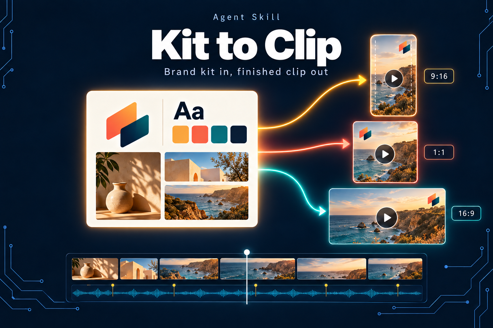
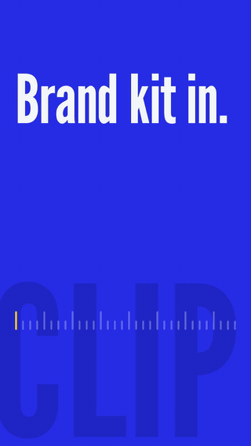

# Kit to Clip

<p align="center">
  
</p>

**Brand kit in, finished clip out.** Kit to Clip is an agent skill for Claude Code (and other agents that read Agent
Skills) that turns your brand kit into finished, on-brand videos with [HyperFrames](https://github.com/heygen-com/hyperframes).
It plans like a motion director, builds every frame in code, scores it with music and effects that land on the beat,
checks it the way a picky editor would, and finishes each cut for where it will be posted.

<table>
  <tr>
    <td width="34%" align="center">
      
    </td>
    <td>
      <p><b>Made by Kit to Clip, from a short brief.</b></p>
      <p>This 15 second Reel was planned, designed, scored, checked and finished by the skill itself: no footage,
      no stock, no video model. Every frame is HTML and GSAP, rendered on the computer it was made on.</p>
      <ul>
        <li>readable with the sound off from the first frame</li>
        <li>21 sound hits, each within a frame of its picture moment (checked on the file)</li>
        <li>mastered to -14 LUFS, inside Instagram's safe zones</li>
      </ul>
    </td>
  </tr>
</table>

```bash
npx skills add JimmySadek/kit-to-clip
```

Then open any repo in Claude Code and say **"make a video"**. The first time, it sets up the video engine (about 1.6 GB,
5 to 10 minutes) in one hidden folder, `~/.kit-to-clip`. **Free and local:** no API keys, no accounts, telemetry off,
and no frame ever leaves your computer.

## What you can make

| Say | You get |
|---|---|
| "Make a reel from this clip" | A 9:16 cut for Instagram Reels, TikTok and YouTube Shorts, inside each app's safe zone |
| "Make a launch film for our feature" | A designed motion film, 16:9 and 9:16, with music and effects on the beat |
| "Announce our launch" | Cards (headline, stat, list, quote, lower third, logo) timed to the music |
| "Make our logo loop" / "an animated GIF for LinkedIn" | A seamless loop or loader: GIF, transparent WebM or MOV, APNG, WebP, an HTML snippet, or Lottie for vector work |
| "A narrated explainer" | A voice-over, word-timed captions and scenes that start on their words |
| "Add music and sound effects" | Sound first: the picture lands on the beats, effects follow the motion, and the sync is checked on the file |
| "Make it like this video" + a link | The reference read (speech, frames, cuts, beats), then a style of your own built on its principles |
| "I want a new style" | Quick sketches of several directions, then a saved style your team can reuse in minutes |

## How it works

```
"make a video"
  ├─ setup     the engine, once (~/.kit-to-clip)
  ├─ brand     your brand's video pack (fonts, logos, colours), or a neutral look
  ├─ what      a format, a saved style, a loop, cards, "like this video", or a new style
  ├─ plan      design skills + a specialist for the video type + the power palette
  │            quick sketches of 5-6 directions ─▶ ✋ you pick ─▶ a layout for every scene
  ├─ sound     music first (generated, aligned to the beat grid), then effects from the motion
  ├─ build     HyperFrames + GSAP, every move seekable, every hit on its beat
  ├─ check     lint · runtime · safe zones · first 3 seconds · beats · sync · flash guard
  └─ deliver   per platform: master, share copy, cover, contact sheet  ─▶ ✋ you listen and approve
```

Nothing renders without a yes: plans and stills come first, because renders take minutes. Videos go into a `reels/`
folder in the repo you are working in (`clips/`, `videos/`, `deliveries/`), kept out of git.

## Taste built in

Kit to Clip plans each video with design skills, so it designs instead of filling slides:

- **[frontend-design](https://github.com/anthropics/skills)** (Anthropic) shapes the look: type, colour, composition,
  a bold direction. Kit to Clip keeps its craft and replaces its web-motion advice with seekable GSAP timelines.
- **[impeccable](https://github.com/pbakaus/impeccable)** critiques the plan, the sketches and the stills: hierarchy,
  spacing, empty space, too timid or too loud.
- **A specialist for the video type**, recommended when the job matches: social shorts, product ads, launch films,
  SaaS demos, explainers, highlight and hype edits, beat-synced edits, kinetic type, data stories, sound design
  (from [calesthio/generative-media-skills](https://github.com/calesthio/generative-media-skills)).

The agent you talk to is the **director**: it plans, builds and checks. On hosts that can start helpers on a smaller,
faster model, it hands them the cheap, parallel work (sketching many directions, mechanical re-cuts) and stays in
charge of every creative call. A helper never works alone.

## Powers

When an idea needs more than HTML and GSAP, the director can reach for a free, local power. Each one is pinned, checked
against a licence policy (no non-commercial, AGPL or revenue-capped licences, ever) and installed only after a yes,
with a fallback when you say no.

| Family | Powers |
|---|---|
| Looks and texture | living shader backgrounds (paper-shaders), generative canvas and painterly brushes (p5, p5.brush), hand-drawn lines (Rough.js) |
| Physics and particles | thousands of particles and confetti (PixiJS), real 2D physics (Rapier), spring motion (Motion) |
| 3D and layers | 3D logos and products (Blender), After Effects-style layers and Lottie export (effectcraft), vector files from .ai and .eps (vectorcraft) |
| Footage | cut people or objects out of clips (HyperFrames cutout, rembg, SAM 2), smooth slow motion (RIFE), sharper frames (Real-ESRGAN), frame-exact edits (filmcraft) |
| Voice and words | a natural voice in several languages (Kokoro), word-level captions (whisper.cpp, Parakeet) |
| Sound | original music from a description (ACE-Step), recorded CC0 effects (Kenney), effects tuned to the music's key |
| References | read a video link: transcript, frames, cuts and beats |

## Sound that lands

- **Music first.** By default the music generator writes an original instrumental from a description, makes several
  takes, aligns each to the beat grid and keeps the strongest. A built-in music maker is the fallback.
- **Effects from the motion.** Whooshes follow what moves; hits sit on the frame something comes to rest, in the
  music's key. Recorded CC0 impacts, clicks and sweeps are the default; synthesised ones fill the gaps.
- **Checked on the file.** `finish.py sync` measures every hit against its picture moment on the rendered video, and
  `finish` refuses a cut that is off. Then you listen: the agent never calls a sound good it has not heard.

## Your brand

Kit to Clip holds no brand. Each brand keeps a **video pack**, a `kit-to-clip/` folder inside its brand kit skill, in
the brand's own repository, so improving the engine never touches a brand and adding a brand never touches the engine.
The front door looks for a brand in this order:

1. a video pack in the repo (`.agents/skills/*/kit-to-clip/` or `.claude/skills/*/kit-to-clip/`),
2. a pointer, `reels/brand.json`, naming a brand kit installed elsewhere,
3. a brand kit without a pack: **brand onboarding** reads it, proposes motion directions, shows stills and saves a pack,
4. installed brands, brand work with no chosen identity, or no brand at all: it asks, or offers a neutral look.

What a brand must provide, the token contract that lets neutral formats style any brand, and a complete example pack:
[`brand/brand-pack.md`](brand/brand-pack.md).

## What's inside

One skill, `kit-to-clip`, with modules it reads only when a step needs them:

| Part | What it does |
|---|---|
| `SKILL.md` (front door) | Sets up the engine, finds the repo's brand, asks what you are making, routes to a module |
| `references/director-and-builder.md` | How a video gets made: the plan, design skills, specialists, the power palette, sketches, helpers, checks |
| `brand/` | Puts a brand's video pack on a project (fonts with licences, logos, tokens); finds the brand's own pictures; turns a website into a brand sheet |
| `formats/` | The formats library: neutral formats for any brand (brand reel, explainer, teaser loop), a brand's own formats, and cards placed on beats or words |
| `finish/` | Platform profiles and checks: safe zones, script errors lint misses, the first three seconds, beats, sync, a flash guard, -14 LUFS mastering, delivery |
| `loops/` | Seamless loops and loaders and their exports |
| `sound/` | Music and effects, sound first: tempo and bars, picture on the beats, effects from the motion, the sync check, the listening checkpoint |
| `toolbox/` | The powers: what each does, how it installs (pinned, checksummed), its licence, its fallback, and the licence and update watches |
| `references/` | Brand onboarding, the style workshop, learning from a video you like, borrowing an effect from an open-source project |

## A video you like

Say **"make it like this video"** with a link (Instagram, TikTok, YouTube, X and more). Kit to Clip reads it, measures
its cuts and whether they land on the music, and turns the borrowed principles (never the footage, music or words)
into the starting point of a style in your brand.

Reading links uses a companion skill, [Video Fetcher to Markdown](https://github.com/JimmySadek/video-fetcher-to-markdown):
transcript with local Whisper, a contact sheet of frames, and the file. Kit to Clip checks for it and asks before
installing it (`npx skills add JimmySadek/video-fetcher-to-markdown`); its download and speech tools go into the engine
folder, not your system.

## Setup details

- The engine folder is `$REEL_STUDIO_HOME` if set, else `~/.kit-to-clip`. Setup installs Node 22, ffmpeg (with
  libx264), Python 3.12 with NumPy, SciPy, OpenCV and fontTools, HyperFrames, GSAP, the pinned agent skills and a
  headless Chrome into it, without admin rights. Run it yourself with `bash setup/install.sh` from a clone.
- Powers install into the same folder, each after a yes. The largest is the music generator (its models are about
  9.4 GB, downloaded on first use).
- Every script expects `source scripts/env.sh` first: telemetry off, no global skill installs, online vision keys
  removed so stills stay local, the engine's own tools on the PATH.
- Updating: run the `npx skills add` command again (or `git pull` in a clone), then re-run setup; it only redoes what
  changed.

> Status: young and moving fast. Tested on macOS (Apple silicon). The neutral brand reel format is a draft, Lottie
> export covers vector animation only, and the quick brand builder (a small provisional brand for repos that have
> none) is not built yet.

## Tests

Negative-control tests: every check must fail on a fixture built to break it and pass on its control.

```bash
source scripts/env.sh && python3 tests/run.py
```

## License

Apache License 2.0, see [LICENSE](LICENSE). HyperFrames, GSAP, the pinned agent skills, the powers and the other tools
the setup downloads keep their own licences; see [NOTICE](NOTICE).
